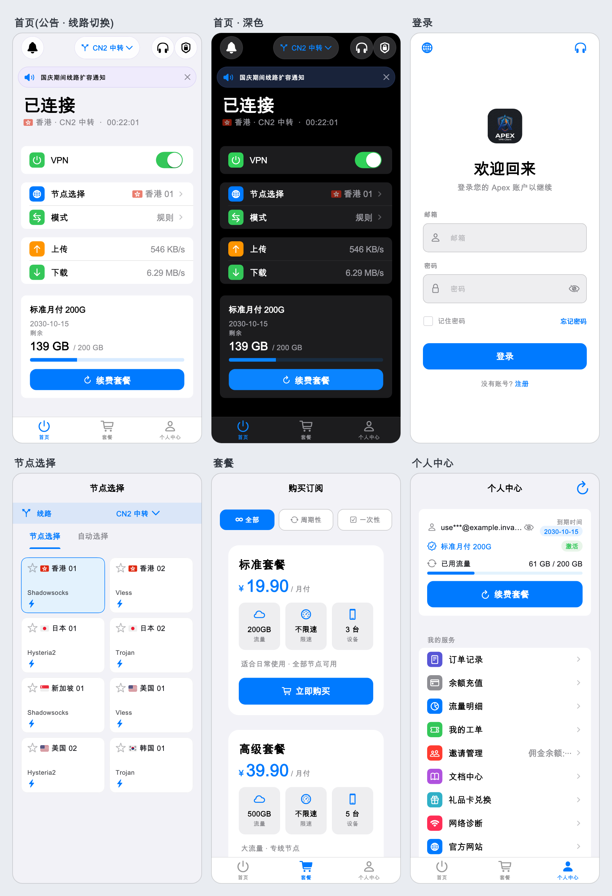
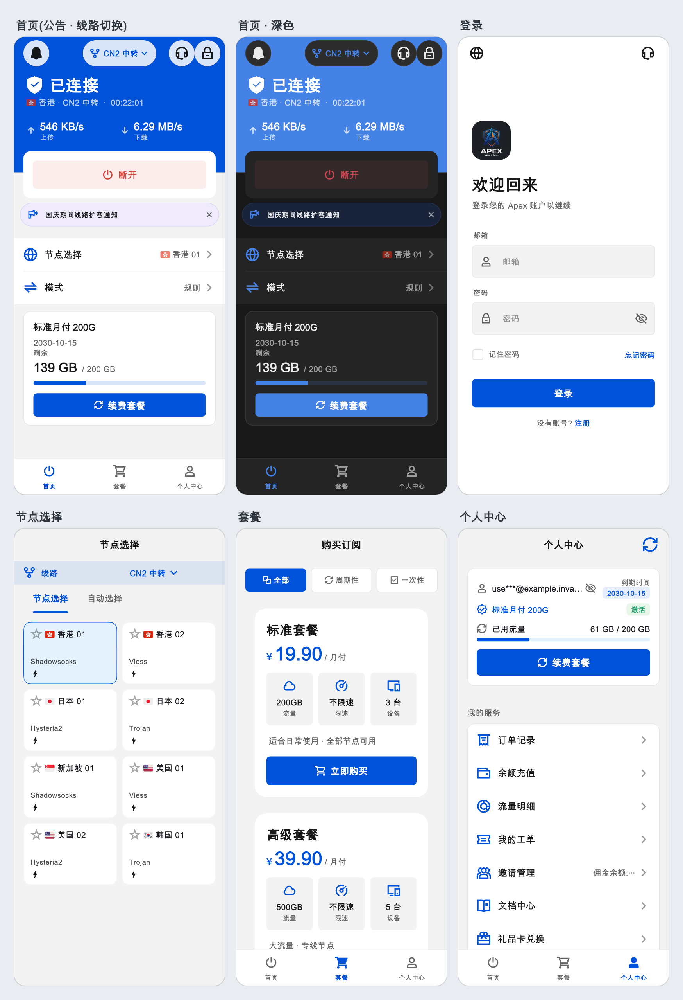
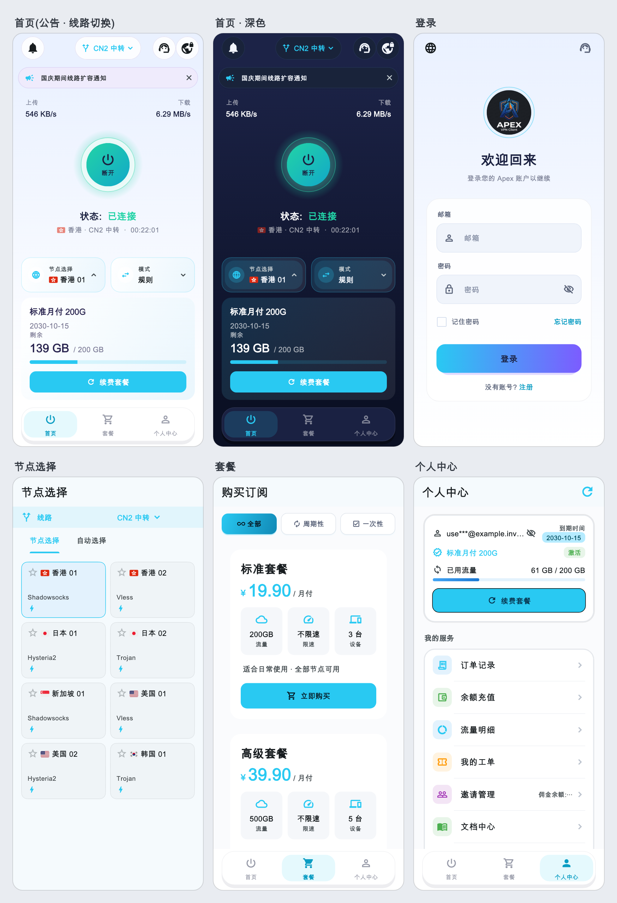
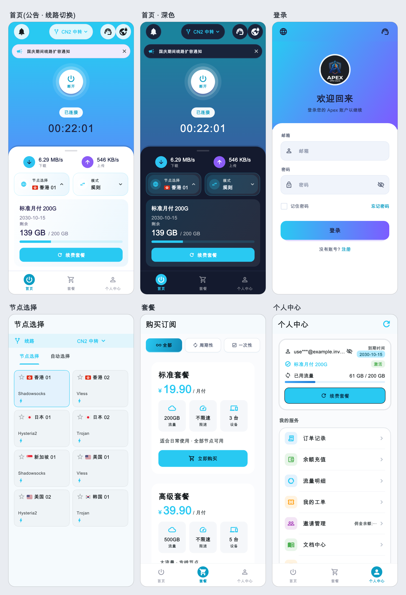
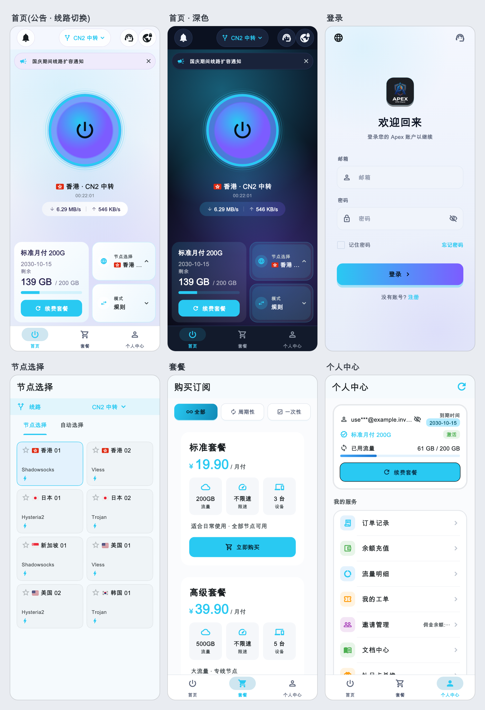

# Apex — Xboard / V2Board 客户端（机场专属品牌 App）

**Xboard 客户端 · V2Board 客户端 · 全平台 Clash Meta（mihomo）机场客户端 · 一键打包**

给机场主用的全平台代理客户端。用户打开就是**你的名字、你的 Logo、你的配色**，登录、买套餐、选节点、找客服都在 App 里完成，不用再教用户导入订阅链接。

出包不需要懂代码：在 Telegram 里找 **[@Apex_build_bot](https://t.me/Apex_build_bot)**，按提示填几项，安装包直接发到你的对话框。

- 支持面板：**Xboard**、**V2Board**（含 wyx2685 版 V2Board）
- 支持平台：**Android 手机 · Android TV · Windows · macOS · Linux · OpenWrt**
- 内核：mihomo（Clash Meta），可选 Smart 智能选路内核
- 语言：简体中文、English、日本語、Русский

---

## 五套界面，打包时任选

每张图是一款界面的总览：首页（带公告和线路切换）、深色首页、登录、节点、套餐、个人中心。

### iOS 风

像 iPhone 的「设置」：首页是分组列表，一行「VPN + 开关」就是连接；苹果图标、苹果开关、圆角分组。

### 简洁（腾讯风）

国内 App 常见的样子：顶部整块主色显示状态和网速，下面一条「连接」长按钮；设置是通栏单元格。

### 光环

渐变背景，正中发光大圆按钮，状态和计时一目了然。最像常见的消费级 VPN。

### 品牌半屏

上半屏铺满你的品牌色，中间白色电源按钮；下半屏放网速、节点和套餐。品牌感最强。

### 经典

霓虹玻璃球连接按钮，底部套餐卡 + 节点 + 模式。

> 除「经典」外，其余四套都会跟着你填的**品牌主色**整体换色。

---

## 用户能在 App 里做什么

### 账号与购买

| 功能 | 说明 |
|---|---|
| 登录 / 注册 / 找回密码 | 直接对接你的面板，支持邮箱验证码、邀请码；可开邮件链接登录 |
| 套餐购买与续费 | 套餐列表、周期选择、优惠券、实付金额；对接面板已配置的支付方式 |
| 订单记录 | 查看历史订单，未支付的订单可继续支付 |
| 余额充值 | V2Board 面板支持 |
| 礼品卡兑换 | 可开关 |
| 邀请返佣 | 邀请链接、佣金记录、划转与提现；可固定代理邀请码 |
| 工单 | 发起工单、图片附件、查看回复 |
| 流量明细 | 每日用量 |
| 登录设备管理 | 看到每台设备的机型，可退出其他设备（Xboard 需装配套插件） |
| 每日签到 | 面板有签到接口时显示 |

### 连接与节点

| 功能 | 说明 |
|---|---|
| 一键连接 | 登录后自动拉取订阅，不需要用户导入链接 |
| 节点选择与测速 | 分组、延迟测试、收藏 |
| 出站模式 | 规则 / 全局 / 直连 |
| **节点线路切换** | 你可以配多条入口线路（中转 / 专线），用户在首页顶部一点即换；可指定哪些节点不跟着换 |
| **链式代理** | 两跳转发，支持用户自建落地节点 |
| **按应用分流** | Android 上指定某个 App 走哪条线 |
| 自定义规则 | 在订阅规则之上加自己的分流规则 |
| 虚拟网卡（TUN） | 桌面端接管全部流量 |
| Smart 智能选路 | 可选内核，按每条连接自动挑节点，带节点排名 |
| IPv6 | 开关可控，机场有 IPv6 节点时可默认开启 |

### 提示与服务

| 功能 | 说明 |
|---|---|
| 公告 | 首页滚动公告条 + 弹窗，读取面板里发布的公告 |
| 到期 / 流量提醒 | 快到期、流量将尽时首页提示并引导续费 |
| 在线客服 | Crisp、SaleSmartly、Chatwoot 三选一 |
| 文档中心 | 展示面板里的知识库文章 |
| 常用软件下载 | 首页放你推荐的 App 入口 |
| 加入群组 / 官网 | Telegram 频道、官网入口 |
| 流媒体与 AI 解锁检测 | Netflix、Disney+、YouTube Premium、TikTok、Spotify、ChatGPT、Claude、Gemini 等 |
| 网络诊断 | 用户自己一键排查「连不上」，可复制报告发给客服 |
| 应用内更新 | 你发新版本，用户在 App 里收到提示并下载；可设强制更新 |

---

## 对机场主有用的地方

- **订阅加密**：订阅内容加密下发，别的客户端拿到链接也读不出节点（需在面板装配套插件，可关闭）。
- **抗干扰**：面板域名可配多个并自动择优；配置放对象存储，换域名不用重新出包；可选内置代理与路径加密中间件，面板域名被干扰时提高登录和拉取订阅的成功率。
- **不暴露订阅链接**：App 里任何位置都不显示、不复制订阅地址。
- **功能可开关**：流量明细、文档中心、礼品卡、加入群组、优惠券、邀请返佣、签到、邮件登录，按需勾选。
- **延迟显示可调**：测速结果可按比例显示。
- **默认语言可设**。

---

## 打包机器人 [@Apex_build_bot](https://t.me/Apex_build_bot)

在 Telegram 里完成全部定制，不需要电脑环境、不需要懂编译。

**流程**

1. 打开 [@Apex_build_bot](https://t.me/Apex_build_bot)，发送 `/start`
2. 新建配置，按表单逐项填写（每一项都写明了是什么、改了要不要重新打包）
3. 选要出的平台，确认
4. 等待构建，安装包自动发到对话框

**可以定制的内容**

| 类别 | 项目 |
|---|---|
| 品牌 | App 名称、英文名、包名、Logo、界面风格（五选一，带预览图）、品牌主色、登录页文案 |
| 面板 | 面板类型、API 域名（可多个）、API 前缀、订阅加密 |
| 线路 | 节点线路、线路例外节点、IPv6 节点、内核选择、Smart 智能模型与节点优先级 |
| 运营 | 官网、Telegram 频道、邀请域名、代理邀请码、常用软件下载、功能开关、默认语言 |
| 客服 | Crisp / SaleSmartly / Chatwoot |
| 更新 | 版本号、更新说明、强制更新、新版下载地址 |

机器人里每一项都标了它存在哪里：存在云端配置里的项目（线路、客服、更新、常用软件等）改完保存即可，**不用重新打包**，已安装的客户端会自动生效；写进安装包的项目（名称、Logo、界面风格等）改了需要重新出包。

**出包平台**

Android 手机、Android TV、Windows、macOS、Linux、OpenWrt，可只选其中几个。

---

## 联系

打包与咨询：Telegram **[@Apex_build_bot](https://t.me/Apex_build_bot)**

---

关键词：Xboard 客户端、V2Board 客户端、Xboard App、V2Board App、机场客户端、机场 App 定制、Clash Meta 客户端、mihomo 客户端、Android / Windows / macOS / Linux / OpenWrt 代理客户端、Xboard client、V2Board client、Clash Meta client
